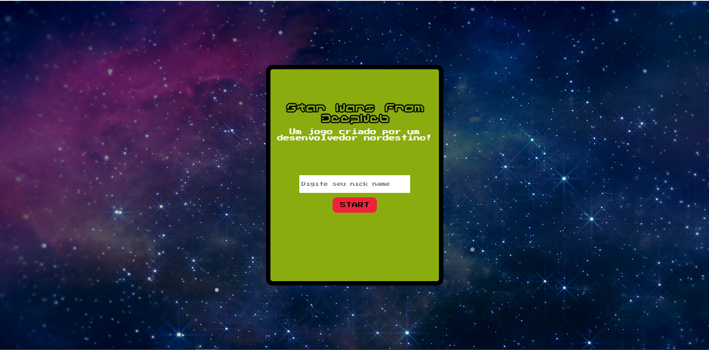
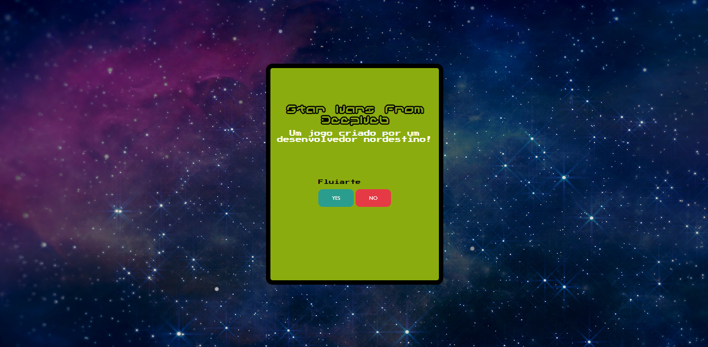

# game-star-wars-deep-web

Um jogo para praticar os conceitos de TypeScript, Sass e html

## Comandos para iniciar: 

```markdown

node >= 14.17.0
npm i
npm start or gulp

```
### Anotações: 

Quando o jogo inicia, apresenta ao jogador uma tela com as informações iniciais.
O sistema analisa jogos que já foram executados e pega as informações. Dessa forma, caso exista, ele perguntará se o jogador deseja continuar com os mesmos dados, caso não haja informações, o jogo vai solicitar o nome do jogador.

A imagem abaixo é a tela inicial caso o jogador não tenha dados de um game passado.



Caso exista:

